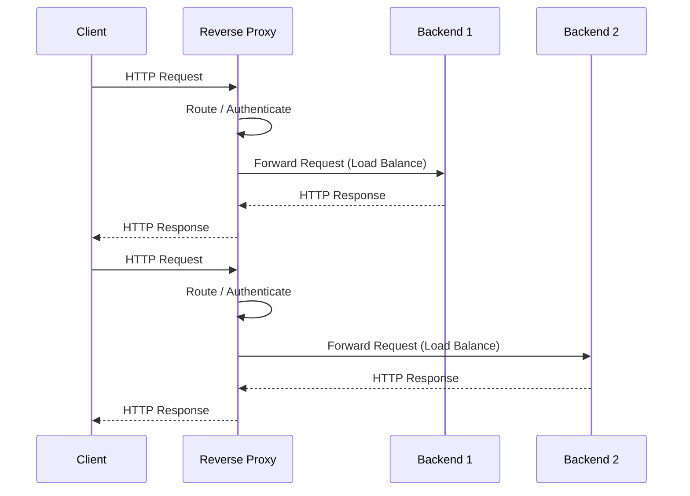

# 01 Reverse Proxy

- A Reverse Proxy is an intermediary server between front and back
- This sits in front of your internal backend servers
- Intercepts all incoming requests from the public internet.
- Hides the server's identity from internet

## Sequence Diagram

## Flash cards

| #   | Frente (Pregunta)                                                                                                          | Reverso (Análisis)                                                                                                                                                                                                                                                                                                                                                                                                                                                                                             |
| --- | -------------------------------------------------------------------------------------------------------------------------- | -------------------------------------------------------------------------------------------------------------------------------------------------------------------------------------------------------------------------------------------------------------------------------------------------------------------------------------------------------------------------------------------------------------------------------------------------------------------------------------------------------------- |
| 1   | ¿Qué fricción histórica, ineficiencia o problema catastrófico exacto obligó a la invención del proxy inverso?              | El colapso de escalabilidad y la exposición directa. En los inicios de la web, las aplicaciones estaban directamente expuestas a internet con IPs públicas. A medida que el tráfico crecía, un solo servidor físico no podía escalar. Además, exponer la base de datos o el servidor de aplicaciones directamente a internet resultaba en vulnerabilidades masivas de seguridad y ataques DDoS. Se necesitaba un "escudo" intermediario que pudiera recibir todo el tráfico y distribuirlo de forma invisible. |
| 2   | ¿Cuáles son las primitivas mínimas e indivisibles de este concepto, y cuál es la regla estricta que rige cómo interactúan? | **Primitivas:** 1) La Interfaz Pública (puerto 80/443 expuesto), 2) El Motor de Enrutamiento (lógica/configuración), 3) El Pool de Backends (los servidores privados). **Regla Estricta:** Aislamiento absoluto. El cliente de internet nunca conoce la existencia, IP, o puerto de los servidores internos. A su vez, los servidores internos solo aceptan conexiones de red que provengan exclusivamente de la IP del proxy inverso, rechazando cualquier intento de conexión directa.                       |
| 3   | ¿Cuál es la alternativa existente más cercana a este concepto, y cuál es el delta exacto y medible entre ellos?            | **Alternativa:** Proxy Directo (Forward Proxy). **Delta Medible:** La dirección de la protección y el anonimato — Proxy Directo oculta la identidad del cliente frente a internet (protegiendo al usuario); Proxy Inverso oculta la identidad de los servidores frente a internet (protegiendo la infraestructura).                                                                                                                                                                                            |
| 4   | ¿Bajo qué parámetros específicos, escala o casos límite este concepto colapsa, se vuelve ineficiente o peligroso?          | **Colapso:** Bajo SPOF. Si el proxy inverso no está en HA con instancias redundantes, su caída hace que toda la plataforma quede inaccesible. **Peligroso:** Si está mal configurado y no inyecta/valida correctamente las cabeceras HTTP (como X-Forwarded-For), arruina los registros de auditoría y permite que atacantes falsifiquen sus IPs de origen.                                                                                                                                                    |
| 5   | ¿Cómo puedo explicar la mecánica subyacente de este concepto a un novato usando una analogía?                              | El spokesperson oficial y el equipo de seguridad de una celebridad. El equipo de seguridad (proxy inverso) recibe todas las peticiones de los periodistas y fans, filtra las peligrosas, y solo pasa las solicitudes legítimas al equipo interno. Los reporteros nunca saben a quién están hablando realmente dentro del edificio, y el equipo interno nunca habla directamente con nadie de afuera.                                                                                                           |
