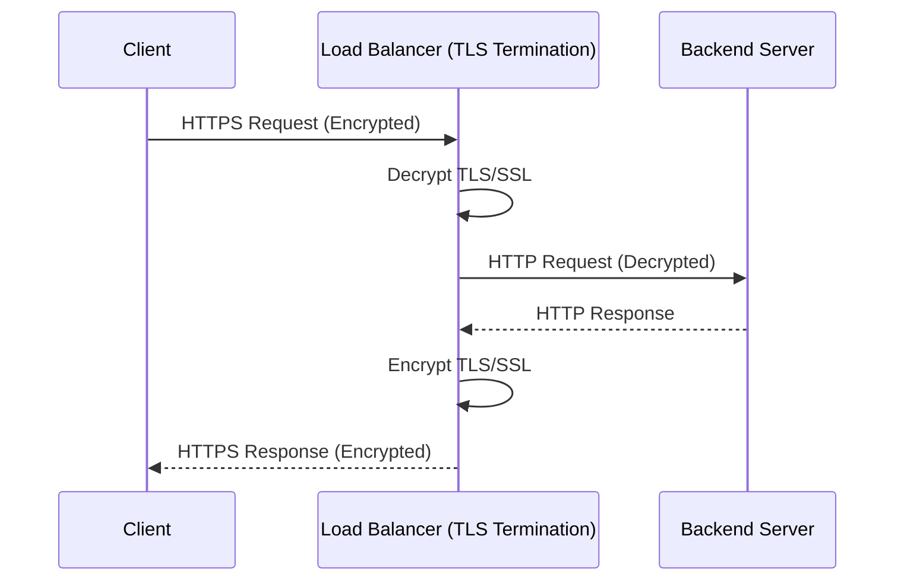

# 02 TLS Termination

- also known as SSL Offloading
- is the architectural practice of decrypting secure HTTPS traffic 
- usually implemented at a Load Balancer or Reverse Proxy like NGINX

## Sequence Diagram

## Flash cards

| #   | Frente (Pregunta)                                                                                                                                  | Reverso (El Análisis)                                                                                                                                                                                                                                                                                                                                                                                                                                                                                                                                                                                                                                   |
| --- | -------------------------------------------------------------------------------------------------------------------------------------------------- | ------------------------------------------------------------------------------------------------------------------------------------------------------------------------------------------------------------------------------------------------------------------------------------------------------------------------------------------------------------------------------------------------------------------------------------------------------------------------------------------------------------------------------------------------------------------------------------------------------------------------------------------------------- |
| 1   | ¿Qué fricción histórica, ineficiencia o problema catastrófico exacto obligó a la invención o descubrimiento de este concepto?                      | El cuello de botella del CPU y la pesadilla de la gestión de certificados. El cifrado y descifrado asimétrico (handshake SSL/TLS) requiere cálculos matemáticos pesados. Los servidores de aplicaciones tempranos colapsaban al intentar ejecutar la lógica de negocio y la criptografía simultáneamente. Además, a medida que los sistemas escalaban, renovar e instalar certificados SSL en 100 servidores individuales era una pesadilla operativa; un solo certificado expirado por error humano causaba interrupciones catastróficas.                                                                                                              |
| 2   | ¿Cuáles son las primitivas mínimas e indivisibles (componentes centrales) de este concepto, y cuál es la regla estricta que rige cómo interactúan? | **Primitivas:** 1. El Proxy de Borde (Edge Proxy/Load Balancer), 2. El Certificado/Clave Privada, 3. La Red Interna Confianza, y 4. El Servidor Backend. **Regla Estricta:** El túnel cifrado proveniente de internet debe morir exactamente en el Proxy de Borde. A partir de ese punto, el proxy debe transformar los datos y transmitirlos hacia el backend exclusivamente en texto plano (HTTP no cifrado) asumiendo que la red interna (VPC) es un entorno completamente aislado y seguro.                                                                                                                                                         |
| 3   | ¿Cuál es la alternativa existente más cercana a este concepto, y cuál es el delta (diferencia) exacto y medible entre ellos?                       | **Alternativa:** TLS Passthrough (Cifrado de Extremo a Extremo o End-to-End Encryption). **Delta Medible:** La visibilidad de la Capa 7 (Aplicación). Con TLS Passthrough, el proxy no puede leer el tráfico; solo ve IPs y puertos (Capa 4), reenviando los bytes cifrados ciegamente. Con TLS Termination, el proxy descifra el paquete, lo que le otorga la capacidad medible de inspeccionar rutas de URL (/api/pagos), leer cookies, y tomar decisiones de enrutamiento inteligente o bloquear inyecciones SQL antes de que toquen la aplicación.                                                                                                  |
| 4   | ¿Bajo qué parámetros específicos, escala o casos límite este concepto colapsa por completo, se vuelve ineficiente o se vuelve peligroso?           | Se vuelve extremadamente peligroso en arquitecturas "Zero Trust" (Cero Confianza) o si el perímetro de la red es vulnerado. Dado que el tráfico viaja en texto plano dentro de la red interna, si un atacante logra penetrar el cortafuegos, puede hacer "sniffing" (captura de paquetes) y robar contraseñas o datos financieros fácilmente. Además, colapsa a nivel de cumplimiento (compliance): regulaciones estrictas como HIPAA (salud) o PCI-DSS (tarjetas de crédito) a menudo prohíben el TLS Termination, exigiendo cifrado hasta el servidor final.                                                                                          |
| 5   | ¿Cómo puedo explicar la mecánica subyacente de este concepto a un novato usando una analogía de un dominio físico o biológico completamente ajeno? | La sala de correo de una prisión de máxima seguridad. Un mensaje llega desde el exterior dentro de una caja fuerte de titanio bloqueada con un código (HTTPS/TLS). La caja no se lleva directamente a la celda del prisionero. En su lugar, se entrega al jefe de la sala de correo (el Proxy). El jefe tiene la única llave, abre la caja fuerte (Terminación de la seguridad externa), lee la carta para asegurarse de que no haya contrabando (inspección de Capa 7), y luego mete la carta en un sobre de papel normal (HTTP en texto plano) para que un guardia interno la lleve caminando de forma rápida y ligera hasta la celda del prisionero. |