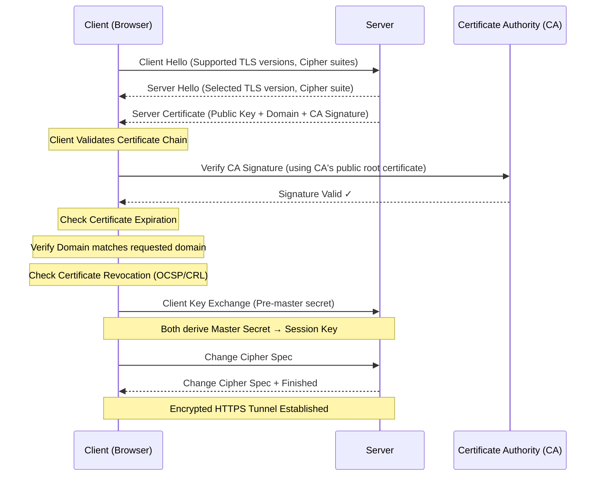

# 03 SSL/TLS Certificate

- A digital credential that mathematically binds a cryptographic key to an organization's identity. 
- It acts as a digital passport for a web server, serving two non-negotiable functions
  1. Authentication: Proving to the client (browser) that the server is legitimately owned by the domain it claims to be
  2. Encryption Facilitation: Providing the public key necessary to initiate a secure, encrypted data tunnel between the client and the server.

## Sequence Diagram

## Flash cards

| #   | Frente (La Pregunta)                                                                                                                               | Reverso (El Análisis del Certificado SSL/TLS)                                                                                                                                                                                                                                                                                                                                                                                                                                                                                                                                                                |
| --- | -------------------------------------------------------------------------------------------------------------------------------------------------- | ------------------------------------------------------------------------------------------------------------------------------------------------------------------------------------------------------------------------------------------------------------------------------------------------------------------------------------------------------------------------------------------------------------------------------------------------------------------------------------------------------------------------------------------------------------------------------------------------------------ |
| 1   | ¿Qué fricción histórica, ineficiencia o problema catastrófico exacto obligó a la invención o descubrimiento de este concepto?                      | El texto plano y la suplantación de identidad. En los inicios de la web, HTTP enviaba todos los datos (contraseñas, tarjetas de crédito) en texto plano, permitiendo a cualquier nodo intermedio leerlos mediante captura de paquetes (packet sniffing). Peor aún, no existía forma técnica de verificar si el servidor "banco.com" era realmente el banco o un clon malicioso creado por un atacante (Man-in-the-Middle). Se requería un mecanismo matemático para cifrar el canal y autenticar la identidad del servidor simultáneamente.                                                                  |
| 2   | ¿Cuáles son las primitivas mínimas e indivisibles (componentes centrales) de este concepto, y cuál es la regla estricta que rige cómo interactúan? | Primitivas: 1. La Clave Pública, 2. La Clave Privada, 3. Los Datos de Identidad (Dominio/Organización), y 4. La Firma Digital de una Autoridad Certificadora (CA). La Regla Estricta: Enlace matemático inquebrantable. La clave privada jamás abandona el servidor. Cualquier dato cifrado con la clave pública del certificado solo puede ser descifrado por esa clave privada exacta. La firma de la CA actúa como el pegamento: garantiza que esa clave pública específica pertenece legítimamente al dominio listado, impidiendo que un atacante inyecte su propia clave pública.                       |
| 3   | ¿Cuál es la alternativa existente más cercana a este concepto, y cuál es el delta (diferencia) exacto y medible entre ellos?                       | La alternativa conceptual es la Red de Confianza (Web of Trust - PGP/GPG). El Delta Medible: Centralización versus Descentralización de la confianza. Los certificados TLS utilizan una jerarquía centralizada (Chain of Trust) donde los navegadores confían ciegamente en un百余 de CAs preinstaladas, requiriendo cero configuración del usuario. La Web of Trust requiere que los usuarios validen y firmen las claves de los demás manualmente de forma descentralizada, lo que proporciona mayor resistencia contra la coerción estatal, pero añade una fricción inmensa en la experiencia de usuario. |
| 4   | ¿Bajo qué parámetros específicos, escala o casos límite este concepto colapsa por completo, se vuelve ineficiente o se vuelve peligroso?           | Colapsa catastróficamente bajo la corrupción de una Autoridad Certificadora (CA). Si un atacante compromete a una CA de confianza (ej. el hackeo de DigiNotar en 2011), puede emitir certificados falsos perfectamente válidos para cualquier dominio (Google, bancos), burlando toda la seguridad de internet. También se vuelve ineficiente en la revocación: los protocolos para verificar en tiempo real si un certificado fue robado (OCSP o CRL) a menudo son lentos, fallan o son ignorados por los navegadores para no afectar el rendimiento, dejando una ventana de vulnerabilidad.                |
| 5   | ¿Cómo puedo explicar la mecánica subyacente de este concepto a un novato usando una analogía de un dominio físico o biológico completamente ajeno? | El pasaporte y el oficial de migración. El certificado SSL/TLS es como un pasaporte físico. Tú (el Servidor web) se lo entregas al oficial de migración (el Navegador del usuario). El oficial no te conoce en absoluto, pero inspecciona el sello holográfico y la firma del gobierno que emitió el pasaporte (la Autoridad Certificadora). Due a que el oficial confía intrínsecamente en ese gobierno, automáticamente confía en que la fotografía (Clave Pública) y el nombre impreso (Dominio) realmente te pertenecen.                                                                                 |