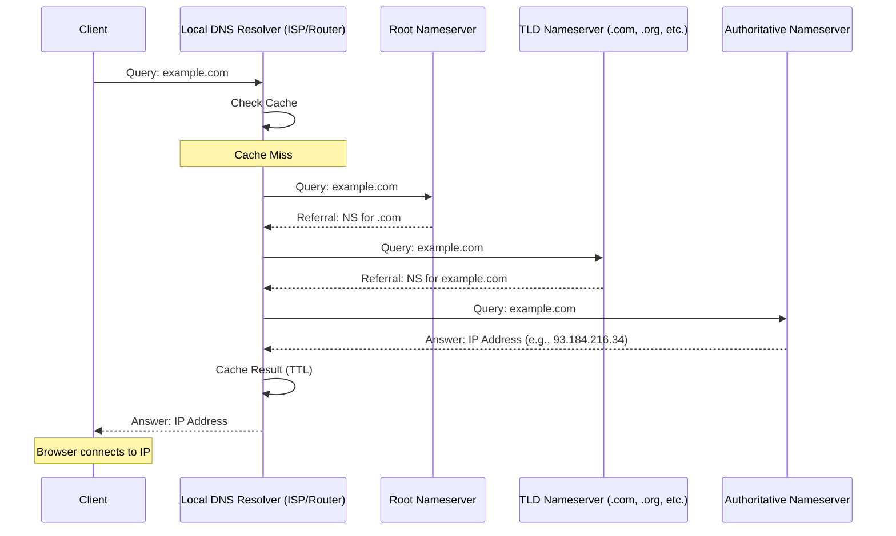

# 04 DNS

- DNS uses **UDP port 53** for most queries (faster, lower overhead than TCP)
- There are **13 root nameservers** worldwide (labeled A-M), each actually thousands of physical servers
- DNS records have **TTL (Time To Live)** values controlling cache duration
- The system was designed in **1983** (Paul Mockapetris) and has barely changed since
- **DNSSEC** adds cryptographic signatures to DNS data to prevent spoofing
- Common record types: **A** (IPv4), **AAAA** (IPv6), **CNAME** (alias), **MX** (mail), **TXT** (verification)

## Sequence Diagram

## Flash cards

| # | Frente (La Pregunta) | Reverso (El Análisis de DNS) |
|---|---|---|
| 1 | ¿Qué fricción histórica, ineficiencia o problema catastrófico exacto obligó a la invención o descubrimiento de este concepto? | El colapso del archivo HOSTS.TXT. En los inicios de la red ARPANET, las direcciones IP se mapeaban a nombres legibles usando un único archivo de texto (HOSTS.TXT) que el Instituto de Investigación de Stanford mantenía y actualizaba manualmente. A medida que la red creció de docenas a miles de computadoras, descargar y sincronizar este archivo centralizado se volvió un cuello de botella insostenible en el ancho de banda y un punto único de fallo masivo. El DNS fue inventado para crear una base de datos distribuida que pudiera escalar globalmente. |
| 2 | ¿Cuáles son las primitivas mínimas e indivisibles (componentes centrales) de este concepto, y cuál es la regla estricta que rige cómo interactúan? | Primitivas: 1. El Resolutor Recursivo (el buscador), 2. Servidores Raíz (.), 3. Servidores TLD (.com), 4. Servidores Autoritativos (los dueños del dominio), y 5. Los Registros (A, CNAME). La Regla Estricta: Delegación jerárquica estricta. Un servidor en la infraestructura DNS nunca intenta adivinar ni buscar en toda la red; o tiene la respuesta exacta (es el autoritativo o la tiene en caché), o devuelve la dirección de red exacta del siguiente servidor inferior en el árbol jerárquico al que el resolutor debe ir a preguntar. |
| 3 | ¿Cuál es la alternativa existente más cercana a este concepto, y cuál es el delta (diferencia) exacto y medible entre ellos? | La alternativa nativa e histórica es el archivo hosts local (presente en tu sistema operativo), y la alternativa descentralizada moderna es el ENS (Ethereum Name Service). El Delta Medible: La dinámica de actualización y administración. Con el archivo hosts, el mapeo es 100% manual y local (cero latencia, pero no escala). Con ENS, la resolución es inmutable y distribuida en un blockchain, pero conlleva costos (gas fees) y latencias de actualización de minutos u horas, frente al DNS tradicional que depende de una autoridad central (ICANN) pero logra latencias de milisegundos gracias a su agresiva arquitectura de caché global. |
| 4 | ¿Bajo qué parámetros específicos, escala o casos límite este concepto colapsa por completo, se vuelve ineficiente o se vuelve peligroso? | Se vuelve extremadamente peligroso bajo ataques de Envenenamiento de Caché (DNS Spoofing) y se vuelve ineficiente debido a la trampa del TTL (Time-To-Live). Si un atacante logra inyectar una IP falsa en el caché del resolutor de un proveedor de internet (envenenamiento), millones de usuarios serán redirigidos a servidores bancarios clonados aunque escriban la URL correcta. A nivel de ineficiencia, si configuras un TTL muy alto (ej. 48 horas) en tus registros DNS y tu servidor principal se incendia, el DNS "colapsa" tu plan de recuperación: no podrás enrutar a los usuarios a tu servidor de respaldo porque el mundo entero seguirá recordando (cacheando) la IP muerta durante dos días. |
| 5 | ¿Cómo puedo explicar la mecánica subyacente de este concepto a un novato usando una analogía de un dominio físico o biológico completamente ajeno? | El sistema de derivación médica hospitalaria. Tienes un dolor muy específico (el dominio). Vas a tu médico general (el Resolutor Recursivo) buscando el tratamiento (la IP). El médico general no lo sabe, así que llama al directorio central del Ministerio de Salud (Servidor Raíz). El directorio le dice: "Esto es digestivo, llama al Hospital de Gastroenterología" (Servidor TLD). El médico llama a ese hospital, quienes le dan el número directo de la clínica privada del Dr. Smith, el especialista exacto en tu enfermedad (Servidor Autoritativo). El Dr. Smith finalmente da la receta médica (la dirección IP), y tu médico general guarda una copia de la receta (Caché) por si otro paciente llega con el mismo dolor mañana. |