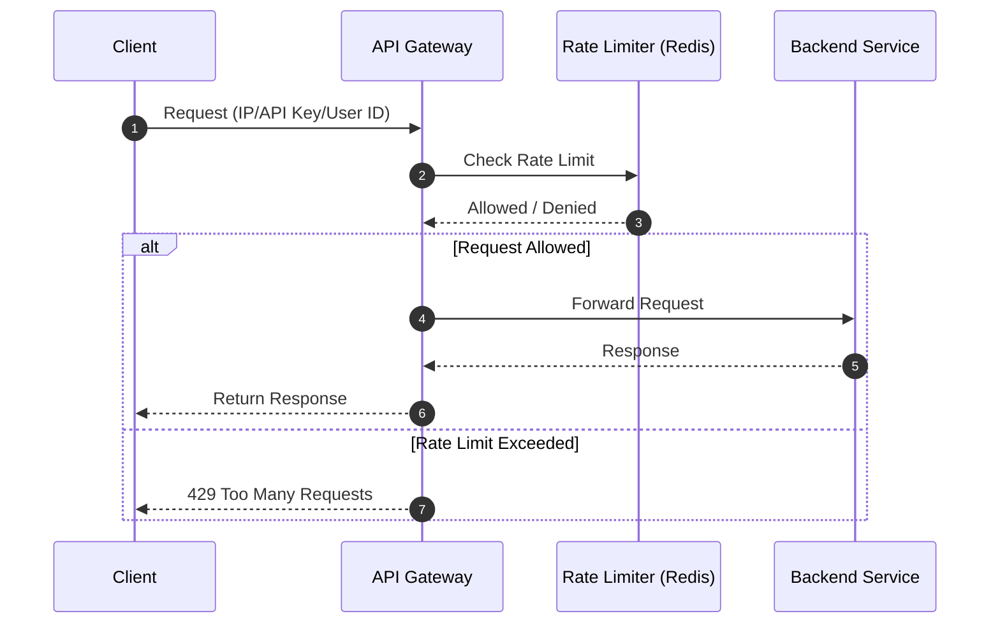
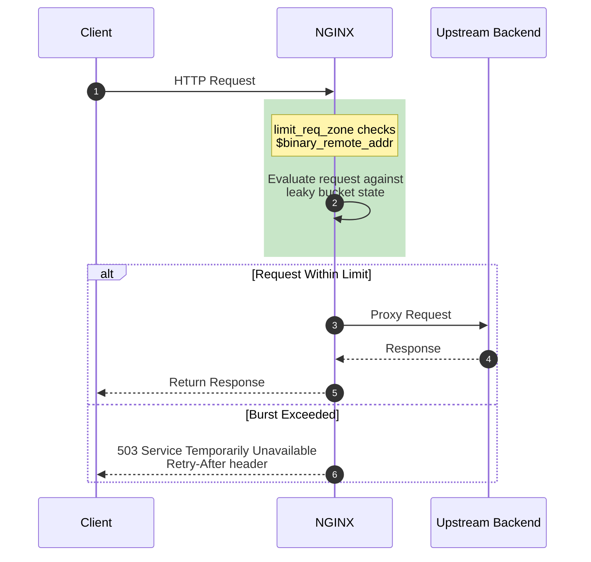

# 05 Rate Limiting

- is a defensive architectural pattern used to control the volume of traffic
- It restricts the number of requests a specific client (identified by IP address, API key, or user ID)
- is allowed to make within a defined time window.

- By intercepting traffic at the edge (usually at an API Gateway or Reverse Proxy),
- rate limiting prevents
  - resource exhaustion
  - mitigates Distributed Denial of Service (DDoS) attacks
  - stops brute-force credential stuffing
  - ensures fair usage among all tenants in a shared system.


## Sequence Diagram



### Flow Description

1. **Client** sends a request to the API Gateway with its identifier (IP address, API key, or user ID)
2. **API Gateway** extracts the client identifier and queries the **Rate Limiter** (e.g., Redis with sliding window or token bucket algorithm)
3. **Rate Limiter** checks if the client has exceeded the allowed number of requests in the current time window
4. **If allowed**: The request is forwarded to the **Backend Service**, which processes it and returns a response. The API Gateway passes the response back to the client
5. **If denied**: The API Gateway immediately returns a `429 Too Many Requests` response to the client without forwarding the request

### Rate Limiting Algorithms

| Algorithm | Description | Pros | Cons |
|-----------|-------------|------|------|
| **Token Bucket** | Tokens accumulate at a steady rate; each request consumes a token | Allows burst traffic | Requires atomic operations |
| **Sliding Window** | Rolling time window counts requests | Smooth rate enforcement | Higher memory usage |
| **Fixed Window** | Requests counted in fixed time intervals | Simple to implement | Boundary spikes |
| **Leaky Bucket** | Requests processed at constant rate | Stable outflow | May delay requests |

### NGINX Rate Limiting Implementation

NGINX uses the ** leaky bucket** algorithm with two directives: `limit_req_zone` (defines the zone) and `limit_req` (applies the limit).

```nginx
http {
    # Define rate limit zone: 10 requests per second per IP
    limit_req_zone $binary_remote_addr zone=mylimit:10m rate=10r/s;

    server {
        location /api/ {
            # Apply rate limit with burst of 5 requests
            limit_req zone=mylimit burst=5 nodelay;
            proxy_pass http://backend;
        }
    }
}
```



#### NGINX Directives Explained

| Directive | Purpose |
|-----------|---------|
| `limit_req_zone` | Defines shared memory zone (`10m` = 10MB) and rate (`10r/s`) |
| `$binary_remote_addr` | Key: client's IP address in binary form (more efficient) |
| `limit_req` | Applies the zone with optional `burst` (queue) and `nodelay` |
| `burst=N` | Allows N requests to queue when rate exceeded |
| `nodelay` | Processes queued requests without delay |

## Flash cards

| Frente (La Pregunta) | Reverso (El Análisis del Rate Limiting) |
| --- | --- |
| **1. ¿Qué fricción histórica, ineficiencia o problema catastrófico exacto obligó a la invención o descubrimiento de este concepto?** | **El problema del "Vecino Ruidoso" (Noisy Neighbor) y el agotamiento de recursos (DDoS/Fuerza Bruta).** En sistemas compartidos, si un solo cliente desplegaba un script con un bucle infinito (por error) o un atacante lanzaba miles de peticiones por segundo, la base de datos y el CPU se saturaban. Esto provocaba que *todos* los demás usuarios legítimos sufrieran caídas del sistema. Se requería un mecanismo defensivo de "cuotas" para garantizar el uso justo de la infraestructura. |
| **2. ¿Cuáles son las primitivas mínimas e indivisibles (componentes centrales) de este concepto, y cuál es la regla estricta que rige cómo interactúan?** | **Primitivas:** 1. El Identificador Único (IP, API Key, Token JWT), 2. El Contador de Estado (almacenado en memoria, ej. Redis), 3. La Ventana de Tiempo, y 4. El Umbral Máximo.<br><br>**La Regla Estricta:** Evaluación previa y atómica. El sistema proxy evalúa el estado *antes* de tocar la aplicación. La lectura y el incremento del contador deben ejecutarse como una sola operación atómica. Si el contador excede el umbral en la ventana de tiempo, el proxy debe abortar el flujo inmediatamente y devolver un `HTTP 429 Too Many Requests`, protegiendo de forma absoluta al servidor backend. |
| **3. ¿Cuál es la alternativa existente más cercana a este concepto, y cuál es el delta (diferencia) exacto y medible entre ellos?** | La alternativa de protección más cercana es el **Load Shedding (Descarte de Carga)**.<br><br>**El Delta Medible:** El alcance de la restricción. El *Rate Limiting* es granular y se basa en el **cliente** (bloquea exclusivamente al Usuario A porque superó sus 100 peticiones/minuto, dejando pasar al Usuario B). El *Load Shedding* es global y se basa en la **salud del servidor** (si el CPU del servidor llega al 95%, empieza a descartar el 20% del tráfico general de *todos* los usuarios de forma aleatoria o por prioridad para evitar un colapso total). |
| **4. ¿Bajo qué parámetros específicos, escala o casos límite este concepto colapsa por completo, se vuelve ineficiente o se vuelve peligroso?** | Colapsa matemáticamente por **condiciones de carrera (race conditions) en sistemas distribuidos masivos**. Si tienes 50 API Gateways consultando un Redis central, la latencia de red puede permitir que una ráfaga masiva simultánea atraviese las validaciones antes de que el contador global se actualice, superando el límite real.<br><br>**Peligroso:** Usar únicamente la dirección IP como identificador. Si cientos de usuarios operan detrás del mismo NAT corporativo o red escolar (una sola IP pública), el tráfico combinado activará el Rate Limit, bloqueando accidentalmente a toda una oficina o escuela entera de usar tu aplicación. |
| **5. ¿Cómo puedo explicar la mecánica subyacente de este concepto a un novato usando una analogía de un dominio físico o biológico completamente ajeno?** | **El cantinero en una barra libre regulada.**<br><br>Imagina que pagas la entrada a una barra libre. El cantinero (API Gateway) tiene una regla estricta para evitar que el bar se quede sin inventario: a cada persona (Identificador) solo le sirve un máximo de 3 tragos cada hora (Umbral y Ventana de tiempo). El cantinero anota tu consumo en una libreta. Si a los 15 minutos pides tu cuarto trago, el cantinero ni siquiera mira hacia las botellas (el Backend); simplemente te rechaza, te muestra la libreta y te dice que vuelvas en 45 minutos (Retry-After). |
