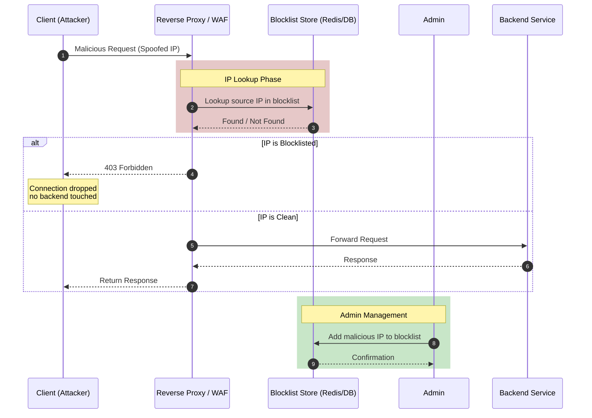
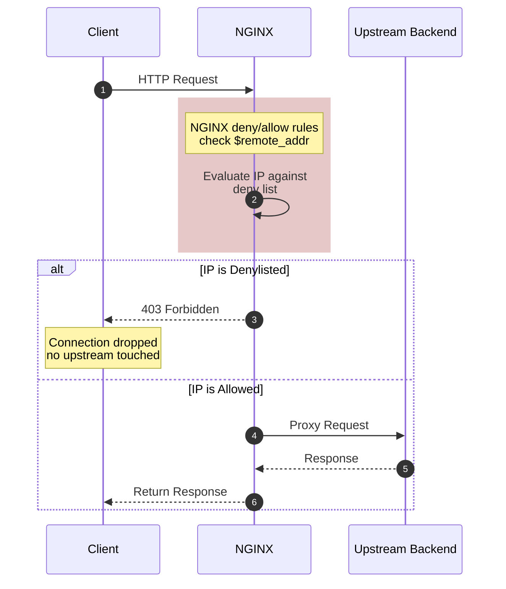

# 06 IP Blacklisting 

- also known as IP Blocking or Deny-listing
- is an edge-layer network security mechanism that outright rejects incoming traffic from specific IP addresses or subnets known to be malicious.
- It checks the client's source IP against a database 
## Sequence Diagram



### Flow Description

1. **Client** sends a request which is intercepted by the **Reverse Proxy / WAF**
2. **Reverse Proxy** queries the **Blocklist Store** (Redis, Redis Bloom filter, or database) to check if the source IP is blocklisted
3. **If IP is blocklisted**: The proxy immediately returns `403 Forbidden` without forwarding to the backend
4. **If IP is clean**: The request is forwarded to the **Backend Service**, which processes and returns a response
5. **Admin** can dynamically add or remove IPs from the blocklist

### Blocklist Lookup Strategies

| Strategy | Description | Performance |
|----------|-------------|-------------|
| **Redis Set** | O(1) lookup with `SISMEMBER` | Fast, constant time |
| **Redis Bloom Filter** | Probabilistic, may have false positives | Very memory-efficient |
| **IP Ranges (CIDR)** | Bitmap or radix tree for subnet blocking | Moderate |
| **Database** | SQL lookup with index | Slower, persistent |

### NGINX IP Blacklisting Implementation

NGINX can block IPs using the `deny` directive or via dynamic blocking with NGINX Plus and Lua.

```nginx
http {
    # Static IP blacklist in nginx.conf
    server {
        location / {
            deny 192.168.1.100;
            deny 10.0.0.0/8;
            allow all;
            proxy_pass http://backend;
        }
    }
}
```



#### NGINX Directives Explained

| Directive | Purpose |
|-----------|---------|
| `deny IP/CIDR` | Blocks specific IP address or subnet |
| `allow` | Permits access (use `allow all` after deny rules) |
| `$remote_addr` | NGINX variable containing client's IP address |
| `ngx_http_access_module` | Built-in module handling allow/deny |

### Flash cards

| Frente (La Pregunta) | Reverso (El Análisis de IP Blacklisting) |
| --- | --- |
| **1. ¿Qué fricción histórica, ineficiencia o problema catastrófico exacto obligó a la invención o descubrimiento de este concepto?** | **El agotamiento de recursos por tráfico basura.** En los inicios de internet, los servidores procesaban cada petición que recibían hasta la capa de aplicación. Esto significaba que procesar un ataque de fuerza bruta, escaneo de puertos o tráfico de botnets consumía los mismos recursos (CPU/RAM y conexiones a la base de datos) que un usuario real, colapsando los servidores rápidamente. Se hizo indispensable un mecanismo para "destruir" las conexiones maliciosas en el perímetro (el borde de la red) con un costo computacional casi nulo. |
| **2. ¿Cuáles son las primitivas mínimas e indivisibles (componentes centrales) de este concepto, y cuál es la regla estricta que rige cómo interactúan?** | **Primitivas:** 1. La dirección IP de origen del cliente, 2. La Base de Datos o Lista de Reglas (el "blacklist"), y 3. El Filtro Intermediario (Firewall, WAF o Proxy Inverso como NGINX).<br><br>**La Regla Estricta:** Evaluación de pre-enrutamiento obligatoria. El filtro debe extraer la IP del paquete de red y compararla contra la lista antes de que el paquete sea reenviado a la red interna. Si hay coincidencia (match), la conexión TCP se corta instantáneamente (drop/reject); la aplicación interna nunca debe enterarse de que el paquete existió. |
| **3. ¿Cuál es la alternativa existente más cercana a este concepto, y cuál es el delta (diferencia) exacto y medible entre ellos?** | La alternativa conceptual espejo es el **IP Whitelisting (Listas Blancas)**.<br><br>**El Delta Medible:** La postura de seguridad por defecto (Default Posture). El Blacklisting opera bajo "Confianza por defecto" (Allow All): deja pasar a los 4 mil millones de direcciones IP de internet excepto a las pocas miles que sabe que son malas. El Whitelisting opera bajo "Cero Confianza" (Deny All): bloquea a todo internet por defecto y solo permite el paso a 3 o 4 IPs específicas que tú autorizaste explícitamente (como la IP de la VPN de tu oficina para acceder a una base de datos). |
| **4. ¿Bajo qué parámetros específicos, escala o casos límite este concepto colapsa por completo, se vuelve ineficiente o se vuelve peligroso?** | Colapsa bajo redes NAT corporativas/móviles y frente a Botnets dinámicas.<br><br>**Peligroso:** Bloquear una sola IP pública maliciosa puede bloquear accidentalmente a miles de usuarios legítimos si todos navegan detrás de la misma IP compartida (ej. todos los dispositivos de una universidad o usuarios de red 5G compartida).<br><br>**Ineficiente:** Se vuelve inútil frente a ataques distribuidos (DDoS) modernos e IPv6, donde el atacante tiene a su disposición millones de direcciones IP dinámicas y rotativas; mantener una lista "estática" actualizada es matemáticamente imposible en tiempo real. |
| **5. ¿Cómo puedo explicar la mecánica subyacente de este concepto a un novato usando una analogía de un dominio físico o biológico completamente ajeno?** | **El cadenero o guardia de seguridad de un club nocturno con un álbum de fotos de personas "vetadas"**.<br><br>En lugar de dejar entrar a un alborotador conocido para que cause problemas y luego pedirle al gerente de piso que lo eche (lo cual consume tiempo y causa pánico), el club pone a un guardia en la puerta exterior (el Firewall). El guardia tiene una libreta con los rostros de personas prohibidas (el Blacklist). Si llegas y tu rostro coincide con la libreta, el guardia te rechaza en la banqueta; no pasas de la puerta y el gerente adentro (el Backend) ni siquiera se entera de que intentaste entrar. |
