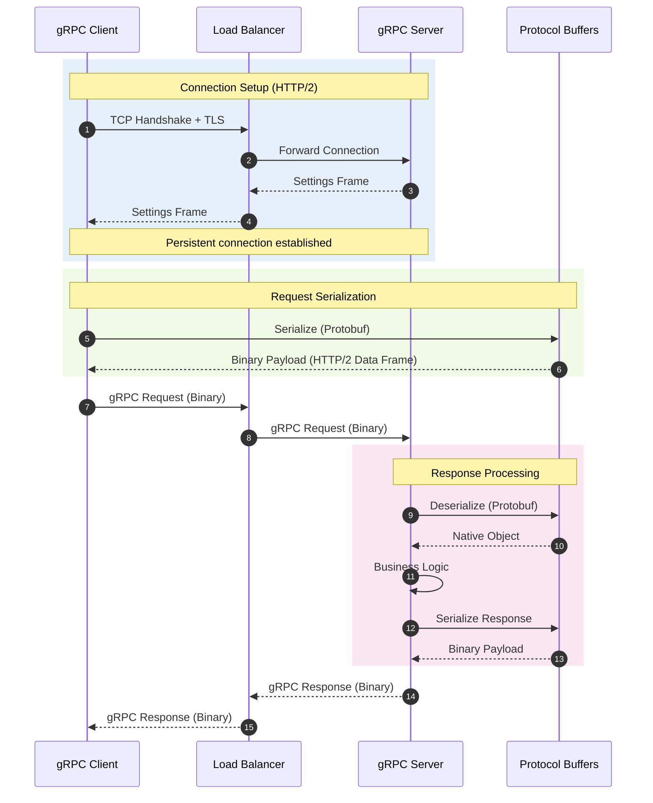
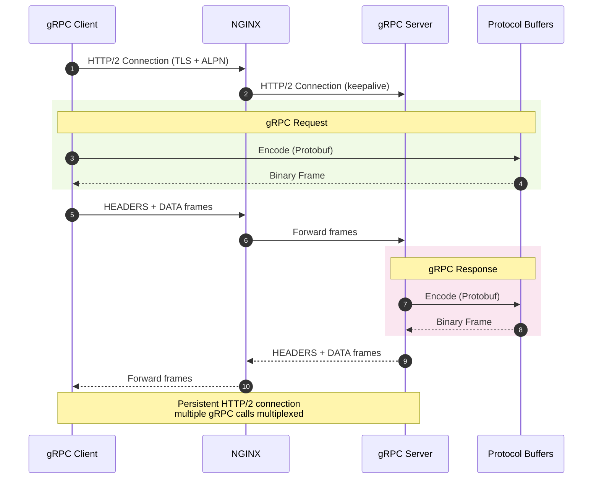
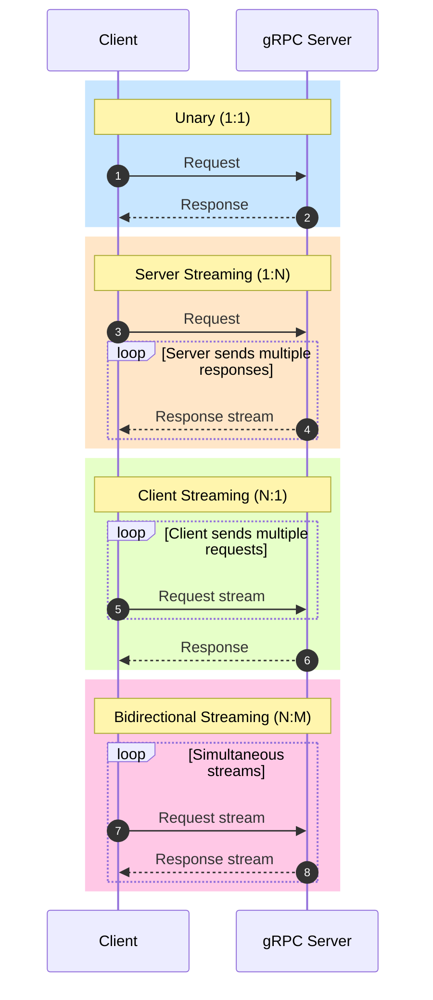

# 07 gRPC

- gRPC (gRPC Remote Procedure Calls) is a high-performance, open-source framework
- allows microservices to communicate with each other as if they were executing local functions.
- gRPC uses Protocol Buffers (Protobuf) to define the data structure and service contracts.
- It auto-generates client and server "stubs" (code wrappers) transmits the highly compressed binary data over HTTP/2
- allows for persistent connections and bidirectional streaming.

## Sequence Diagram



### Flow Description

1. **Connection Setup**: Client establishes a persistent HTTP/2 connection via Load Balancer to the gRPC Server
2. **Request Serialization**: Client serializes the request object to binary using Protocol Buffers
3. **Request Transmission**: Binary payload is sent over HTTP/2 Data Frame through the Load Balancer
4. **Response Processing**: Server deserializes the binary payload, processes business logic, and serializes the response
5. **Response Transmission**: Binary response is sent back through Load Balancer to Client

### gRPC vs REST Comparison

| Feature | gRPC | REST |
|---------|------|------|
| **Protocol** | HTTP/2 | HTTP/1.1/2 |
| **Data Format** | Protocol Buffers (binary) | JSON/XML (text) |
| **Contract** | .proto file (strict) | OpenAPI/Swagger (optional) |
| **Streaming** | Bidirectional, native | Limited (via WebSocket) |
| **Code Gen** | Automatic from .proto | Manual or OpenAPI tools |
| **Performance** | ~6x faster than JSON | Slower parsing |

### NGINX gRPC Proxy Implementation

NGINX provides native gRPC proxying since version 1.13.10 using `grpc_pass` directive.

```nginx
http {
    # gRPC server definition
    upstream grpc_backend {
        server localhost:50051;
        keepalive 64;
    }

    server {
        listen 443 ssl http2;
        ssl_certificate /etc/ssl/certs/server.crt;
        ssl_certificate_key /etc/ssl/private/server.key;

        location / {
            grpc_pass grpc://grpc_backend;
            grpc_set_header Host $host;
        }
    }
}
```



#### NGINX gRPC Directives

| Directive | Purpose |
|-----------|---------|
| `grpc_pass` | Routes gRPC requests to upstream (e.g., `grpc://backend`) |
| `grpc_set_header` | Sets custom headers for gRPC metadata |
| `listen ... http2` | Enables HTTP/2 with ALPN for gRPC negotiation |
| `keepalive` | Maintains persistent connections to upstream |

### Streaming Patterns



## Flash cards

| Frente (La Pregunta) | Reverso (El Análisis de gRPC) |
| --- | --- |
| **1. ¿Qué fricción histórica, ineficiencia o problema catastrófico exacto obligó a la invención o descubrimiento de este concepto?** | **El cuello de botella del parseo de texto y HTTP/1.1.** Con el auge de las arquitecturas de microservicios, miles de sistemas internos hablando entre sí usando JSON sobre HTTP/1.1 generaban una sobrecarga masiva. Procesar (parsear) texto JSON consumía demasiado CPU en la serialización/deserialización, y HTTP/1.1 sufría de latencia por no poder enviar múltiples peticiones simultáneas sobre una misma conexión TCP. Las empresas a hiper-escala (como Google) necesitaban un protocolo interno que fuera ultrarrápido y ligero para evitar malgastar millones de dólares en servidores solo para traducir texto. |
| **2. ¿Cuáles son las primitivas mínimas e indivisibles (componentes centrales) de este concepto, y cuál es la regla estricta que rige cómo interactúan?** | **Primitivas:** 1. El Contrato (archivo .proto), 2. Protocol Buffers (el formato binario de serialización), 3. Los Stubs (código autogenerado para el cliente y servidor), y 4. El transporte HTTP/2.<br><br>**La Regla Estricta:** Contrato Tipado como Única Fuente de la Verdad. Cliente y servidor están estrictamente acoplados al mismo contrato .proto. Ninguno de los dos puede comunicarse a menos que hayan precompilado exactamente los mismos Stubs. Si el esquema no coincide, la comunicación falla; no hay flexibilidad para campos "sorpresa" como ocurre en JSON. |
| **3. ¿Cuál es la alternativa existente más cercana a este concepto, y cuál es el delta (diferencia) exacto y medible entre ellos?** | La alternativa universal es **REST** (representando datos con JSON sobre HTTP).<br><br>**El Delta Medible:** Densidad de red y velocidad de CPU. Debido a que gRPC usa Protocol Buffers (binario), el tamaño del payload (carga útil) en la red es consistentemente un 30% a 50% más pequeño que un JSON equivalente. En el CPU, la velocidad de serialización/deserialización de binarios estructurados es mediblemente más rápida (entre 5 y 10 veces), ya que la máquina no tiene que escanear caracteres de texto, buscar comillas o hacer asignaciones dinámicas de memoria. |
| **4. ¿Bajo qué parámetros específicos, escala o casos límite este concepto colapsa por completo, se vuelve ineficiente o se vuelve peligroso?** | Colapsa operativamente en dos casos: **Navegadores web nativos** y **Balanceo de carga tradicional (Capa 4)**.<br><br>Primero, los navegadores no exponen el control total de HTTP/2 necesario para que gRPC funcione directamente, obligando a usar un proxy mediador (gRPC-Web) que destruye su simplicidad. Segundo, como gRPC mantiene una conexión HTTP/2 persistente y de larga duración, un balanceador de red estándar enviará todo el tráfico de un cliente a un solo servidor backend, saturándolo. Requiere forzosamente infraestructura de Capa 7 (como Envoy o arquitecturas service-mesh) capaz de inspeccionar y distribuir petición por petición, no por conexión. |
| **5. ¿Cómo puedo explicar la mecánica subyacente de este concepto a un novato usando una analogía de un dominio físico o biológico completamente ajeno?** | **El libro de códigos de espionaje.**<br><br>En REST/JSON, mandas un paquete con una etiqueta explícita: "Nombre: Juan, Edad: 30". Es fácil de leer para cualquiera, pero el paquete es grande y pesado. En gRPC, el emisor y el receptor comparten por adelantado un libro de códigos idéntico (el archivo .proto). Al enviar el mensaje, empaquetas todo al vacío y solo mandas la secuencia 1J30. Viaja rapidísimo por la red ocupando el mínimo espacio, pero para cualquiera que lo intercepte (o intente leerlo sin el libro de códigos exacto), es solo ruido incomprensible. |

